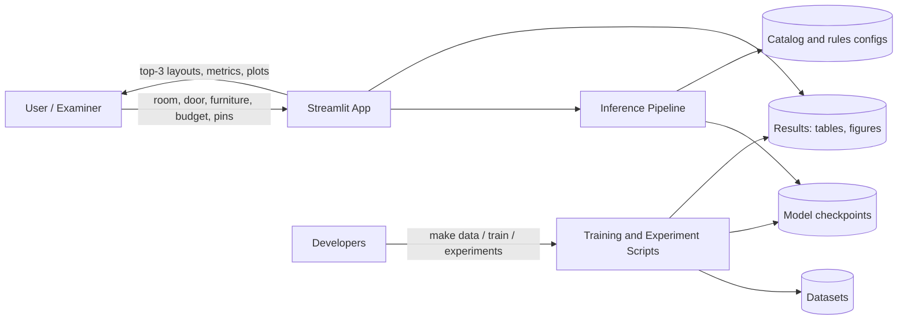
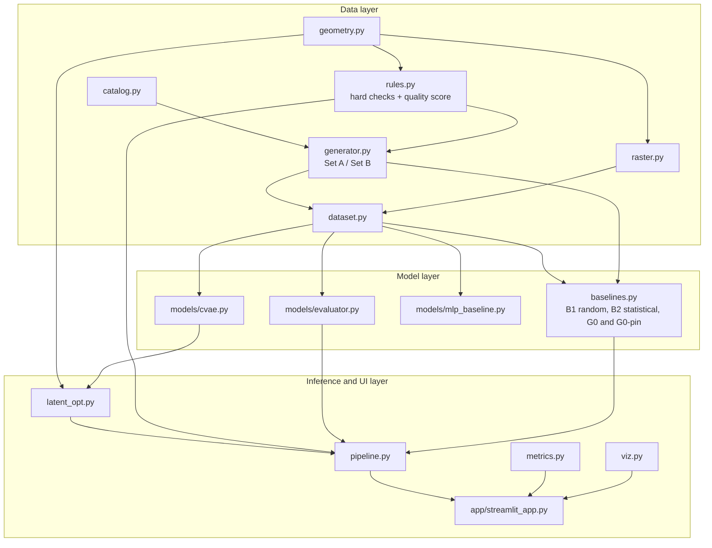
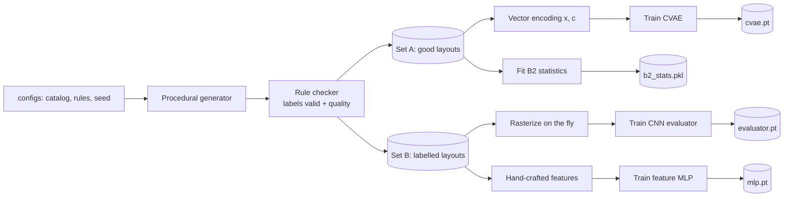
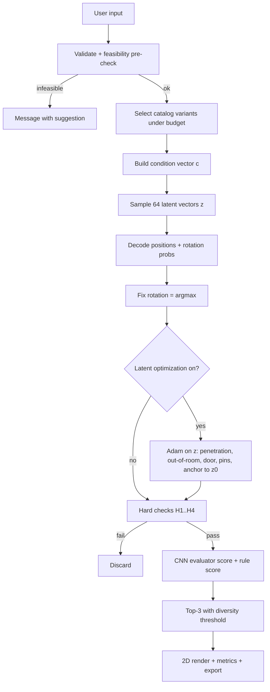
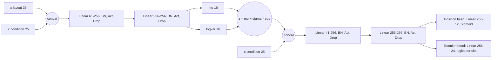
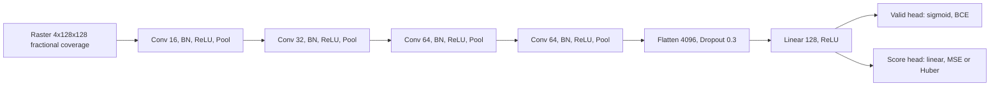
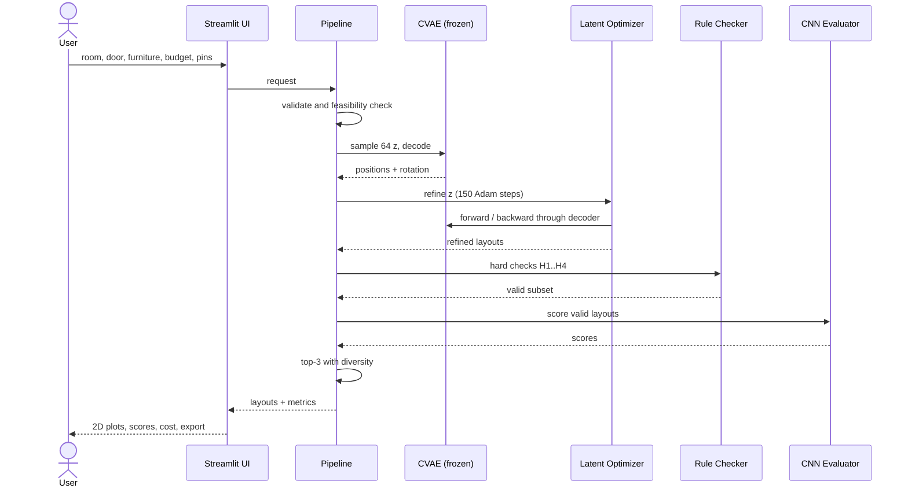

# SpaceGen AI: Architecture

| Field | Value |
|---|---|
| Version | 1.3 (revised after three technical reviews) |
| Companion docs | PRD.md, Tech_Spec.md, Development_Plan.md |
| Diagram format | Mermaid (renders in GitHub, VS Code preview, and most Markdown viewers). Plain-text fallbacks are included for the key diagrams. |

---

## 1. Architecture at a glance

SpaceGen AI is a **local, modular Python application** with three layers:

1. **Data layer:** catalog, rules, procedural generator, rasterizer, datasets.
2. **Model layer:** CVAE generator, CNN evaluator, feature-MLP baseline, baselines B1 and B2, and the procedural reference G0 (with a pinned variant).
3. **Inference and UI layer:** latent optimization, checker, ranking, Streamlit app.

The design principle is **learn to propose, then verify**. Neural networks propose and score layouts. A deterministic rule engine verifies them. Gradient-based latent optimization connects the two by using the differentiable part of the rules to steer the generator.

---

## 2. System context



Plain-text version:
```
User -> Streamlit App -> Inference Pipeline -> {Checkpoints, Catalog/Rules configs}
Developers -> Training/Experiment scripts -> {Datasets, Checkpoints, Results}
Streamlit App -> shows Results (figures, tables)
```

---

## 3. Component view



### 3.1 Module responsibilities

| Module | Responsibility | Depends on | Owner (suggested) |
|---|---|---|---|
| `geometry.py` | Rotation handling, effective footprints, exact overlap area for the checker, penetration depth for the loss (NumPy and PyTorch versions), containment | none | A |
| `catalog.py` | Load items, variants, prices; selection helpers | config | B |
| `rules.py` | Hard checks H1 to H4, reachability (distance transform and `ndimage.label`, all equivalent faces for symmetric items), quality score `S` | geometry, catalog | B |
| `generator.py` | Procedural layouts (styles, jitter), perturbations, labels | rules, catalog | B |
| `raster.py` | Layout to 4-channel 128x128 fractional-coverage raster on a fixed 8 m canvas (a differentiable version is optional, for M3) | geometry | A |
| `dataset.py` | Vector encoding of `x` and `c`, normalization, splits, PyTorch datasets | generator, raster | A |
| `models/cvae.py` | Encoder, decoder, loss terms (masked recon, KL) | dataset | A |
| `models/evaluator.py` | CNN with valid and score heads | raster | B |
| `models/mlp_baseline.py` | Feature-based MLP for comparison | rules | B |
| `baselines.py` | B1 uniform random, B2 statistical sampler, G0 wrapper and G0-pin (generator, move the pinned item, filter) | dataset, generator | A |
| `latent_opt.py` | Differentiable constraint loss and Adam on `z` | cvae, geometry | A |
| `pipeline.py` | Feasibility, selection, sampling, refinement, checks, ranking, top-3 | all above | shared |
| `metrics.py` | RVR, overlap, diversity, F1, Spearman, active units | rules | shared |
| `viz.py` | 2D layout plots (3D optional) | geometry | B |
| `app/streamlit_app.py` | UI, method comparison, export | pipeline, viz | B |

---

## 4. Data flow

### 4.1 Training-time flow



### 4.2 Inference-time flow



Plain-text version:
```
input -> validate/feasibility -> select variants -> build c -> sample z (64)
      -> decode -> fix rotation -> [latent optimization] -> hard checks
      -> CNN score -> top-3 with diversity -> render + metrics
```

---

## 5. Model architectures

### 5.1 CVAE



Notes:
- The condition `c` is concatenated at both encoder and decoder inputs.
- At generation time the encoder is unused: `z ~ N(0, I)` goes straight to the decoder.

### 5.2 CNN evaluator



### 5.3 Tensor shapes (batch B, K = 6)

| Tensor | Shape |
|---|---|
| Layout target `x` | (B, 36) |
| Condition `c` | (B, 25) |
| Latent `z`, `mu`, `logvar` | (B, 16) |
| Decoder positions | (B, 12) reshaped to (B, 6, 2) |
| Decoder rotation logits | (B, 24) reshaped to (B, 6, 4) |
| Presence mask `m` | (B, 6) |
| Raster | (B, 4, 128, 128) |
| Evaluator outputs | valid (B, 1), score (B, 1) |

---

## 6. Runtime sequence (app request)



---

## 7. Key data structures

### 7.1 Layout JSON (interchange format between pipeline, UI, exports and the 3D view)
```json
{
  "room": {"type": "living_room", "width": 5.2, "depth": 4.1},
  "door": {"wall": "S", "offset": 0.30, "width": 0.9},
  "items": [
    {"slot": 0, "id": "sofa_3seater", "w": 2.10, "d": 0.90, "h": 0.85,
     "x": 2.60, "y": 0.75, "rotation": 0, "price": 28000}
  ],
  "metrics": {"valid": true, "checks": {"H1": true, "H2": true, "H3": true, "H4": true},
              "rule_score": 0.82, "eval_score": 0.79, "cost": 43000, "space_use": 0.24},
  "meta": {"method": "cvae_lo", "seed": 0, "model_version": "cvae_v1", "dataset_hash": "..."}
}
```
(`rotation` uses the class index 0 to 3 defined in the Tech Spec.)

### 7.2 Dataset file layout
```
data/v1/
  set_a_train.npz  set_a_val.npz  set_a_test.npz
  set_b_train.npz  set_b_val.npz  set_b_test.npz
  heldout_interp.npz  heldout_unseen_combo.npz  heldout_out_of_range.npz  g0_reference.npz
  metadata.json      # generator config, seed, counts, hash
```
Each `.npz` holds arrays for `c`, `x`, presence mask, sizes, room and door parameters, and (Set B) `valid` and `quality` labels.

---

## 8. Cross-cutting concerns

| Concern | Approach |
|---|---|
| **Configuration** | YAML files; one master seed; per-experiment overrides; config saved next to every checkpoint |
| **Reproducibility** | Seeds for Python, NumPy, PyTorch; dataset hash in checkpoint metadata; one `make experiments` target rebuilds all tables and figures |
| **Device handling** | `device = cuda if available else cpu`; batch sizes small so CPU works |
| **Logging** | Console plus CSV logs per run (loss curves, per-layer gradient norms, dead-unit percentage) |
| **Error handling** | Input validation with clear user messages; infeasible-request message; fallback when fewer than 3 valid layouts exist (return what exists, note it) |
| **Testing** | pytest suite listed in the Tech Spec; smoke test for the full pipeline |
| **Out-of-distribution guard** | Warn if room size is outside the training ranges |
| **Security and privacy** | Local only; no personal data; inputs are numeric and validated |
| **Performance** | Batch all 64 candidates as tensors; vectorized pairwise overlap; reachability on small grids; training data kept on the GPU as tensors (no DataLoader); rasters built on the fly on the GPU as outer products of 1-D overlaps (precomputing Set B would need about 16 GB) |

---

## 9. Deployment view

**Demo (in scope):** everything runs locally.

```
Laptop (Windows/Linux) -> Python venv -> streamlit run app/streamlit_app.py
```

**Production sketch (for the ethics and deployment section of the report, not built):**
```
Client -> FastAPI (input validation, versioned models) -> Inference pipeline
       -> model registry (checkpoints + dataset hash) -> monitoring (OOD inputs, latency)
```

---

## 10. Architecture decision records (ADRs)

| ID | Decision | Alternatives considered | Rationale | Trade-off |
|---|---|---|---|---|
| ADR-1 | Synthetic, rule-generated dataset | Download real dataset (3D-FRONT, other) | We need our own labels (valid, quality) and inputs; real sets are scarce, large, or heavy to set up; synthetic gives control for experiments | Model learns our rules; mitigated with several styles, jitter and a real-room test set |
| ADR-2 | Furniture sizes are inputs, model predicts centre and rotation only | Predict sizes too | Sizes are known from the catalog; smaller output; exact overlap math | Cannot suggest new sizes |
| ADR-3 | CVAE generator | GAN, diffusion, transformer | Small data vectors, stable training, fits laptop, clear math (ELBO, KL, reparameterization), diversity via sampling | Possible blurry or averaged outputs; posterior collapse risk |
| ADR-4 | One model per room type (config driven) | One model with union of slots | Simpler slot semantics, less confusion | Two trainings if bedroom is included |
| ADR-5 | Latent optimization after generation | Filtering only; penalty only at training | Uses backprop at inference; directly reduces violations; supports pinned items | Extra hyperparameters; can reduce diversity |
| ADR-6 | Rotation is fixed (argmax) during latent optimization | Relax rotation with soft probabilities | Rotation is discrete; keeping it fixed avoids non-differentiable steps | Cannot fix a wrongly rotated item by optimization; a pinned item is the exception, because the user's requested facing overwrites its rotation before optimization |
| ADR-7 | Fixed 8 m physical canvas at 0.0625 m per pixel (128x128) with exact fractional coverage | Stretch each room to a fixed size; 0/1 pixels at 0.125 m | Preserves real scale; sub-pixel overlaps change the pixel values, so near-misses near the checker tolerance are visible | Bigger input and slower CNN; near-misses are still at the resolution limit |
| ADR-8 | Rule engine is deterministic and separate from learning | Learn constraints only | Guarantees validity; gives labels; makes results verifiable | Rules are our assumptions |
| ADR-9 | Streamlit UI | Web stack (React plus API) | Fast to build in Python; enough for the demo | Not production-grade |
| ADR-10 | Keep the CNN evaluator as a study, a possible surrogate, and a learned ranker reported next to the exact rule score; do not present it as a speed-up | Rank by rule score only; drop the CNN | The CNN is not needed for correctness and is not faster than the rule check (both tiny next to the latency budget). It supplies the CNN study (E9a) and the surrogate experiment (M3, E8b); the rule score stays the reference | Extra components whose value is experimental and educational; stated plainly |
| ADR-11 | Penetration depth (min over axes) as the overlap loss; exact area only in the checker | Intersection area as the loss | Area has zero gradient when one box is contained in the other's extent; penetration depth always pushes the pair apart | Slightly different from the checker's measure, so validity is always judged by the checker |
| ADR-12 | Anchor term `norm(z - z0)^2` in latent optimization | Prior term `norm(z)^2` | The prior pulls every candidate to `z = 0` and destroys diversity; the anchor keeps candidates near their own start | Loses the global-prior interpretation; it acts as a trust region |
| ADR-13 | Canonical labels for symmetric items, with access and orientation handled over all equivalent faces | Arbitrary rotations; canonical labels with single-face checks | Arbitrary rotations give contradictory targets; single-face access would reject valid layouts (a side table stored at r=0 against the north wall) | Slightly more complex checker and raster |

---

## 11. Extension points

| Extension | Where it plugs in | Cost |
|---|---|---|
| Bedroom domain (P2) | New catalog and rules config; retrain CVAE with the same code | Low to medium |
| Windows | Add channel to raster, extra clearance rule, extra condition entries | Medium |
| GRU autoregressive decoder | Alternative `models/` module with the same interface as the CVAE | Medium |
| 3D view | Consumes layout JSON only; no model changes | Low |
| CNN surrogate in latent optimization (M3) | Differentiable raster in `raster.py`; extra term in `latent_opt.py` | Medium; risk that the optimizer exploits the surrogate |
| Natural-language input | New front-end module producing the same request object | Medium |
| Multi-room layouts | Would need new representation and models | High (out of scope) |

---

## 12. Design invariants (rules the code must respect)

1. All geometry checks run in **meters**; normalized coordinates exist only at the model boundary.
2. The **checker is the single source of truth** for validity; no model output is shown as valid without passing it.
3. Every "good" training layout is **re-verified** by the checker before it enters Set A.
4. Models never see held-out room sizes during training or model selection.
5. Every reported number can be regenerated from a **seed, config and dataset hash**.
6. During latent optimization, the decoder is frozen and in `eval()` mode.
7. Training targets are in **canonical form** (symmetric items and interchangeable slots), and metrics compare layouts after canonicalization. The checker and raster treat all equivalent faces of symmetric items alike.
8. Early stopping and checkpoint selection use the validation loss at `beta_target` and start only after KL annealing ends.
