# SpaceGen AI: constraint-aware furniture layout generation with deep learning

**Deep Learning mini project report.** Team: [Member A], [Member B].

Code and every result in this report: <https://github.com/YashPandit09/DL_MiniProject>. Section 10.3 gives the commands that regenerate them.

## Abstract

We generate furniture layouts for a living room as structured data, so that every layout can be checked exactly. A conditional VAE proposes 64 candidates for a room, gradient descent on each candidate's latent vector repairs rule violations through the frozen decoder, a rule checker verifies every candidate, and a CNN ranks the valid ones. The training data comes from a rule-based generator of our own, which also serves as the reference for every result.

On 500 test rooms, 69.8 ± 0.9% of the pipeline's raw samples are valid (three seeds), against 17.3% for the CVAE alone, 57.8% for a statistical sampler and 10.1% for random placement; latent optimization is what makes the difference. The three layouts shown to the user score 0.85 on our quality score, against 0.67 without the CNN's ranking. Twelve controlled experiments explain the design: the scale of the position loss matters more than its shape (MAE beats MSE and Huber), BatchNorm hides vanishing gradients and dying ReLU, the raw model's validity is a poor guide to the pipeline's (Tanh doubles one and lowers the other), and the CNN judges gross violations almost perfectly but boundary cases only 81% of the time.

We also report what did not work. The rule-based generator is about nine times cheaper per valid layout than the learned pipeline and its layouts score higher, and it stays ahead even when the user pins a piece of furniture, the case we expected to favour the learned approach. Reachability, which is not differentiable, causes more than half of the pipeline's remaining failures.

---

## 1. Introduction

### 1.1 Problem

Most AI room-design tools produce a *picture* of a furnished room. A picture can look convincing while the furniture overlaps, blocks the door or leaves no path to walk on, and because a picture has no measurable structure, nobody can check. We treat a layout as **structured data** instead: every piece of furniture has a position and a facing inside a room with a door. A layout in this form can be checked exactly, scored, compared and repaired.

The task: given a living room (width, depth, the wall and position of its door) and a list of up to six pieces of furniture, produce several different layouts that are physically valid and sensible to live in.

### 1.2 Approach

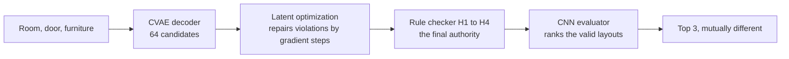

1. A **conditional variational autoencoder (CVAE)** learns the distribution of good layouts for a room and furniture list. Sampling its latent vector gives many different candidates in one forward pass.
2. **Latent optimization** takes each candidate and moves its latent vector by gradient descent, through the frozen decoder, to remove overlaps, wall protrusions and door blockages.
3. A **rule checker** tests every candidate exactly: inside the room, no overlap, door clear, every item reachable. Only layouts that pass are shown. Validity never depends on a neural network.
4. A **CNN evaluator**, trained on top-down images of layouts, ranks the valid ones, and the three best that differ enough from one another are returned.

We call the CVAE alone **M1** and the CVAE with latent optimization **M2**.

### 1.3 Why train a network when rules can already generate layouts?

Our training data comes from a rule-based procedural generator that we wrote (**G0**). It produces valid layouts by construction, so an honest report has to ask what the network adds. We measured it instead of assuming it:

- **On validity, the learned pipeline beats the non-neural samplers, but only with latent optimization.** 70% of M2's raw samples are valid, against 58% for the statistical baseline B2 and 10% for uniform random placement B1. The CVAE alone (M1, 17%) does not beat B2. Section 5.9.
- **For an ordinary request, G0 is cheaper.** It needs about nine times less compute per valid layout than M2, as we expected before measuring. Section 5.9.
- **The learned pipeline's layouts are not as good as G0's.** M2's valid layouts score 0.66 on our quality score against 0.88 for G0's; the three layouts the pipeline shows score 0.85 against 0.89. Section 5.9.
- **We expected the learned pipeline to earn its place when the user pins a piece of furniture**, because a template generator has no template to follow there. **The data does not support that either.** With one item pinned, the generator with that item simply moved to its spot is valid more often than M2 (47% of samples against 39%), scores higher and costs less. Section 5.11.

So the generator stays in the system as the data source and as the reference every result is compared with. The project's value is the controlled study of the deep learning components around it: which loss, activation, optimizer and regularizer work for this problem and why (Sections 5.1 to 5.6), whether gradient-based repair in latent space works (5.7), what a CNN can and cannot see in a layout image (5.8), and how the whole pipeline compares with simple baselines and generalizes to unseen rooms (5.9, 5.10).

### 1.4 What was built

- A geometry and rule engine with four hard checks and a quality score, and a procedural generator with three layout styles.
- Dataset v1: 30,000 good layouts for the CVAE, 60,000 labelled layouts for the evaluator, three held-out test sets, all reproducible from one seed with a content hash.
- A CVAE (177,732 parameters), a CNN evaluator (585,682 parameters), latent optimization, the end-to-end pipeline and a Streamlit app.
- Twelve experiments, each a controlled comparison with saved tables and figures, and 400 automated tests.

### 1.5 Scope and assumptions

One room type (a rectangular living room with one door), six furniture slots, four facing directions. The design rules, score weights, furniture sizes and prices are **our own assumptions**, not an official standard or retail data; they are collected in `configs/rules.yaml` and `configs/catalog.yaml` and marked as such. We make no claim of state-of-the-art results or of novelty over published work.

---

## 2. Related work

**Rule- and optimization-based furniture layout.** Merrell et al. [1] encode interior-design guidelines as terms of a density function and sample layouts from it with a Monte Carlo sampler. Yu et al. [2] learn spatial relationships from example rooms, combine them with ergonomic terms such as visibility and accessibility into a cost function, and minimize it by simulated annealing. Our procedural generator and quality score belong to this family: hand-written guidelines, with rejection instead of annealing.

**Learned indoor scene synthesis.** Wang et al. [3] generate rooms object by object with convolutional networks that read a top-down image of the scene so far. ATISS [4] treats a room as an unordered set of objects and generates it with an autoregressive transformer, which also allows completing a partial scene. DiffuScene [5] denoises the attributes of all objects jointly with a diffusion model. The last two train on professionally designed rooms from 3D-FRONT [6], a dataset of 18,968 furnished rooms.

**Layout generation with variational autoencoders.** LayoutVAE [7] generates scene layouts (bounding boxes) from a set of labels with conditional VAEs, the closest published relative of our generator. The underlying methods are the VAE [8] and its conditional form [9], the weighting of the KL term [10] and KL annealing [11].

**Constraints through latent optimization.** Kikuchi et al. [12] generate graphic layouts that satisfy user constraints (alignment, no overlap) by optimizing the latent code of a pre-trained layout generator, rather than retraining it. Our latent optimization applies the same idea to furniture, with geometric penalty terms and an anchor to each candidate's starting point.

**Where this project stands.** It does not advance on these works. It is much smaller in every respect: synthetic training data produced by our own rules instead of designer-made rooms, one rectangular room type, six items, four rotations, a multilayer perceptron instead of a transformer or diffusion model. What it adds for a course project is that every part is measurable: an exact checker defines validity, a procedural generator provides an honest reference, and each deep learning choice is tested in a controlled experiment.

---

## 3. Dataset

No public dataset has the labels we need (validity under our rules and a quality score) at a size a laptop can handle, so the data is synthetic and generated by our own code. This gives full control for experiments. The price is stated in Section 8: the model can only learn our rule-based notion of a good layout.

### 3.1 Representation

A room is an axis-aligned rectangle of width $W$ and depth $D$ meters. The door sits on one of the four walls at an offset $o \in [0, 1]$ along it; a formula keeps it at least 0.65 m from any corner. A 0.9 × 0.9 m **clearance zone** in front of the door must stay free.

Each of the six slots (sofa, TV unit, coffee table, bookshelf, armchair, side table) is either absent or present with a catalog size. A present item has a centre and one of four facings; turning it by 90° swaps its width and depth. The sofa and the TV unit are always present.

The networks see two vectors:

- **Condition $c$ (25 values):** $W/8$, $D/8$, the door wall (one-hot), the door offset, six presence flags, six widths and six depths.
- **Target $x$ (36 values):** per slot, the centre as fractions of the room ($u = x/W$, $v = y/D$) and the facing (one-hot).

**Canonical labels.** A coffee table looks the same after a half turn and a square side table after any quarter turn. If the data stored such facings freely, the same layout would have several different targets and the network would be trained towards their average. Every layout is therefore stored in one canonical form (a symmetric item's facing is reduced to its smallest equivalent), and the checker, the image raster and the score treat all equivalent faces alike.

### 3.2 The procedural generator (G0)

For each room the generator draws the furniture (optional items appear with a probability that rises with floor area, from 0.25 in the smallest rooms to 0.75 above 30 m²) and then tries up to 20 placements. Each attempt picks one of three styles that fit the room:

- **(a) wall sofa:** the sofa's back against a wall, the TV unit against the opposite wall;
- **(b) floating sofa:** the TV unit against a wall, the sofa facing it 1.5 to 3.5 m away with a walkway behind it;
- **(c) L-shape:** as (a), with the armchair against a side wall facing the coffee table.

Spacings are drawn at random inside their allowed ranges, and the first attempt that passes the rule checker is kept. Style (a) needs one side of the room between 2.9 and 4.8 m, so it is impossible in about a quarter of rooms; that is why all three styles exist.

### 3.3 Dataset v1

| Part | Size | Notes |
|---|---|---|
| Set A, for the CVAE | 30,000 layouts | from 30,206 rooms: 0.7% were dropped after 20 failed attempts; 57% of placement attempts were kept; styles 46% wall sofa, 48% floating sofa, 6% L-shape; mean quality 0.88 |
| Set B, for the evaluator | 60,000 layouts, 62% valid | half are generator layouts, half are perturbed copies labelled by the checker |
| Splits | 70 / 15 / 15 | 21,000 / 4,500 / 4,500 of Set A; 42,000 / 9,000 / 9,000 of Set B |
| Held-out test sets | 1,000 rooms each | rooms that training never sees, Section 3.4 |
| Diversity reference | 3,992 layouts | 20 generator layouts for each of 200 test rooms |

Set B's perturbations are position jitter (three strengths), turned items, fully random placement, a forced overlap, and **near-misses**: one item slid until it overlaps a neighbour by an amount right at the checker's tolerance, or until it sits within 3 cm of the door zone's edge. Near-misses test what the CNN can see at the resolution of its input image. Every sample stores its perturbation type, so the evaluator's results can be reported per type.

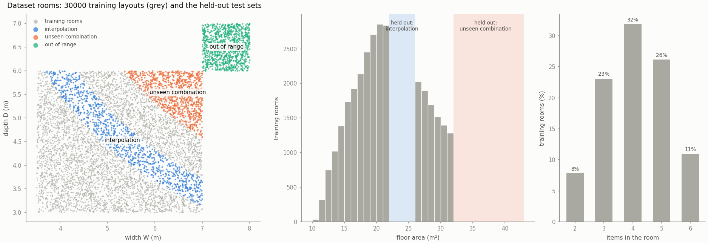

### 3.4 Held-out rooms

Three regions are excluded from training by drawing a room again whenever it falls inside one (a test asserts that none leaks):

- **Interpolation:** floor areas of 22 to 26 m², a gap in the middle of the training range.
- **Unseen combination:** areas above 32 m². Each width and depth also occurs in training, but never together.
- **Out of range:** widths of 7 to 8 m and depths of 6 to 7 m, beyond every training value.

Above 32 m² almost every generator layout uses the floating sofa (99% and 100% of the last two sets), because a wall sofa needs a side of at most 4.8 m. Results on those sets therefore mostly test one style.

### 3.5 Rejection and what it does to the data

The generator rejects 79% of its attempts in rooms of 8 to 12 m² and 12% at 28 to 32 m². Because the room stays fixed for up to 20 attempts, almost every room still ends up in the data (99.3%), so room sizes follow the designed distribution. Within a room, though, the layouts that survive are those that are easier to place, so crowded arrangements are rarer than a designer might produce.

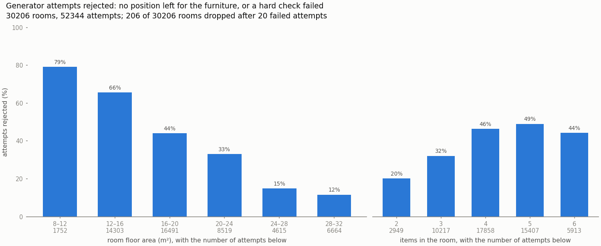

**How crowded can a room be?** The footprint ratio is the furniture's floor area divided by the free floor. We fitted a logistic curve to "the generator furnished the room within 20 attempts" against this ratio; it crosses one half at 0.377. The pipeline therefore refuses requests above $f_\text{max} = 0.38$ with a suggestion (remove an item, choose a smaller variant) instead of producing a bad layout.

### 3.6 Reproducibility of the data

`python run.py data` rebuilds the dataset in about 7 minutes. Each part draws from its own random stream derived from one seed, and `metadata.json` records the seed, the configuration files, the git commit and a SHA-256 hash of the contents. A rebuild in a fresh clone of the repository reproduced the hash exactly (`ef1535ee...`, Section 10.3).

---

## 4. Methods

### 4.1 The rule checker and the quality score

A layout is **valid** if it passes four hard checks:

| Check | Meaning | Tolerance |
|---|---|---|
| H1 | every item lies inside the room | 1 mm |
| H2 | no two items overlap | at most 0.005 m² per pair |
| H3 | the door's clearance zone is free | 0 |
| H4 | every item that needs access can be reached from the door | see below |

**Reachability (H4).** The floor is divided into 10 cm cells. A cell is walkable if it is at least 0.3 m from every item and wall, which stands for a person's half-width. The cells connected to the centre of the door's clearance zone form the reached region. An item is reachable if the reached region comes within 0.3 m of the line 0.35 m in front of its front face. The TV unit is exempt: it is viewed, not walked up to.

**Quality score.** Valid layouts are scored in $[0, 1]$:

$$S = 0.30\, S_\text{align} + 0.30\, S_\text{relations} + 0.25\, S_\text{circulation} + 0.15\, S_\text{space}.$$

Alignment rewards items that belong against a wall for standing against one. Relations reward four pairwise arrangements (the sofa's distance to the TV unit, the coffee table in front of the sofa, the side table beside it, the armchair facing the table). Circulation is the share of free floor that can be walked. Space rewards covering 15 to 40% of the floor. The score is exact and cheap; it is the reference that the CNN evaluator is trained to imitate.

### 4.2 The conditional VAE

**Why a CVAE and not a network that maps a room to one layout?** A room has many good layouts. A deterministic network trained on them would output their average, which is usually not a good layout at all (a sofa halfway between two walls). A CVAE has a latent variable $z$ that selects *which* good layout to produce, so different samples of $z$ give different layouts for the same room.

**Architecture.** Both networks are multilayer perceptrons with two hidden layers of 256 units, each followed by BatchNorm, ReLU and dropout (0.1).

- The **encoder** $q(z \mid x, c)$ reads a layout and its condition (61 values) and outputs the mean and log-variance of a 16-dimensional Gaussian.
- The **decoder** $p(x \mid z, c)$ reads $z$ and the condition (41 values) and has two output heads: a Sigmoid head for the 12 position values, and a head with four logits per slot for the facing.

**Loss.** With mask $m_k$ for present items:

$$L = \underset{\text{batch}}{\text{mean}} \sum_k m_k \big[\, \ell_\text{pos}(u_k, v_k) + \text{CCE}(r_k) \,\big] + \beta \cdot \underset{\text{batch}}{\text{mean}}\ \text{KL}\big(q(z \mid x, c)\,\|\,\mathcal{N}(0, I)\big).$$

The position loss $\ell_\text{pos}$ is the mean absolute error in the frozen configuration (chosen in Section 5.6). The facing uses categorical cross-entropy on the logits. The appendix derives the KL term, the reparameterization and the gradients.

**Training.** Adam, learning rate $10^{-3}$, batch 256, at most 200 epochs. $\beta$ rises linearly from 0 to 0.1 over the first 20 epochs (KL annealing). Early stopping (patience 15) uses the validation loss at the final $\beta$ and starts counting only after annealing; otherwise the rising $\beta$ would make the loss climb and stop training at once. The whole dataset sits on the GPU as tensors, so an epoch takes about half a second.

**Generating.** At inference, $z \sim \mathcal{N}(0, I)$ is drawn, the decoder outputs positions and facings, positions are clamped to the room, and each facing is the arg-max of its logits in canonical form.

### 4.3 The CNN evaluator

**Input.** A layout is drawn as a 4-channel, 128 × 128 top-down image on a fixed 8 m canvas, so a meter is always 16 pixels: (1) the room, (2) the furniture, with overlaps showing as values above 1, (3) a thin band on each item's front, (4) the door's clearance zone. Each pixel holds the *exact fraction* of its area that a box covers, so a 1 cm move changes the image. The images are computed on the GPU for each batch; storing them for Set B would need about 16 GB.

**Architecture.** Four blocks of convolution, BatchNorm, ReLU and max-pooling (16, 32, 64, 64 channels) reduce the image to 64 × 8 × 8. A 128-unit layer with dropout feeds two outputs: a logit for "valid" and a predicted quality score.

**Loss.** Binary cross-entropy on validity plus the squared error of the score.

**Its role, stated plainly.** The checker and the rule score are exact, so the evaluator is **not needed for correctness, and it is not faster** than the rule check. It is in the project for three reasons: as a controlled study of what a CNN can read from a layout image (Section 5.8); as the learned ranker of the final top 3, reported next to the exact score (Section 5.9); and as a starting point that could later be tuned on human preferences, which no rule score captures.

### 4.4 Latent optimization (M2)

A candidate $z_0$ often decodes to a layout that breaks a rule. With the decoder's weights frozen, we minimize over $z$:

$$L_c(z) = 10 \sum_{i<j} \text{pen}_{ij}^2 + 10 \sum_k \text{out}_k + 10 \sum_k \text{pen}_{k,\text{door}}^2 + 0.05 \cdot \tfrac12 \lVert z - z_0 \rVert^2 ,$$

with Adam (learning rate 0.05) for at most 150 steps. $\text{pen}_{ij}$ is the **penetration depth** of two items: how far they must slide apart to be 5 cm clear of each other. $\text{out}_k$ is how far item $k$ sticks out of the room.

- **Why penetration depth and not the overlap area?** If one item lies inside another along an axis, moving it does not change the overlap area, so the area's gradient is zero and the optimizer gets no direction. The penetration depth always points apart (appendix, Section 7).
- **Why the anchor to $z_0$?** It keeps every candidate near its own starting sample, so the candidates stay different from one another and close to what the decoder learned. Shrinking $\lVert z \rVert$ instead would pull all of them towards the same point.
- **Why is this not cheating?** The optimization only moves candidates; it cannot declare one valid. Afterwards the same rule checker decides, unchanged. The optimization target has no reachability term at all, so a repaired layout can still fail H4, and many do (Section 7).

Facings are fixed at the decoder's choice for $z_0$, because an arg-max has no gradient. BatchNorm and dropout run in inference mode.

### 4.5 The pipeline

For a request the pipeline (1) checks the inputs and warns when the room is outside the training ranges; (2) chooses furniture variants: among the combinations within the budget and the footprint limit $f_\text{max}$, the one with the largest footprint; (3) samples 64 candidates and repairs them (M2); (4) keeps those that pass H1 to H4; (5) ranks them by the evaluator's score; (6) returns the best three that are at least 0.3 m apart on average per item, relaxing that distance twice if too few qualify. A request that cannot be furnished gets a message and a suggestion, never a bad layout.

### 4.6 Baselines and the reference

| Name | What it does |
|---|---|
| **B1** uniform | places every item uniformly at random inside the room, facing a random way |
| **B2** statistical | no neural network: each item's position and facing are copied from a training layout with a similar room and the same door wall, with small noise, and drawn again (up to 10 times) if the item overlaps one already placed or sticks out of the room |
| **G0** generator | the procedural generator of Section 3.2. Its outputs are valid by construction, so it is a **reference**, not a competitor: we report its acceptance rate per attempt, its cost and its quality |
| **M1** | the CVAE's samples |
| **M2** | the CVAE's samples after latent optimization |

### 4.7 Evaluation protocol and metrics

Every method gets the **same 500 test rooms** and **64 raw samples per room**, with no filtering.

- **Raw valid rate (RVR):** the share of raw samples that pass H1 to H4. For G0 it is the acceptance rate of single placement attempts.
- **Quality:** the mean rule score of the valid samples; and the mean score of the **top 3 the pipeline would show**, with the valid samples ranked by the evaluator.
- **Diversity:** the mean distance between pairs of valid layouts of the same room (centre distance per shared item, plus 0.5 m if the facing differs), as a ratio to the same quantity for G0's layouts.
- **Cost per valid layout:** sampling, optimization and checking time divided by the number of valid layouts.

M1 and M2 are trained with three seeds and reported as mean ± standard deviation over the seeds; every seed samples the same rooms with the same random draws, so the spread is the training's. Three seeds give a description, not a significance test.

**The configuration is chosen on validation rooms.** Screening shortlisted settings with a quick check that sampled test rooms, a weakness we state in Section 8. The choice among the shortlisted settings used 200 *validation* rooms (Section 5.6), and the headline numbers were measured afterwards on the test rooms.

### 4.8 Reproducibility

One helper seeds Python, NumPy and PyTorch and switches PyTorch to deterministic algorithms, so two runs with the same seed on the same machine give **bit-identical** weights. Every run saves its seed, configuration, git commit and the dataset hash. This was checked in practice, not only in a unit test: the three final CVAE models, retrained from `configs/frozen.yaml`, are bit-identical to the ones trained two days earlier for the comparison of Section 5.6, and the baselines' rows of the final E1 table reproduce the Week 1 baseline table exactly. Section 10.3 lists what a regeneration compared.

---

## 5. Experiments

**Protocol.** One factor is varied at a time around the default configuration (MSE position loss, ReLU, BatchNorm, dropout 0.1, Adam at $10^{-3}$, $\beta = 0.1$, 16 latent dimensions). Sections 5.1 to 5.5 are **screening**: one seed per setting, 48 trainings of about a minute each. Screening reports the validation loss, the reconstruction error (mean distance in meters between a validation item and its reconstruction with $z = \mu$) and a first raw valid rate of M1 on 100 rooms with 64 samples each. That M1 check sampled test rooms, so screening only *shortlists*; Section 5.6 makes the choice on validation rooms with three seeds, and Sections 5.7 and 5.9 to 5.11 use the frozen configuration.

### 5.1 E2: which position loss?

| Position loss | Mean position error | KL (nats) | Active latent units | M1 raw valid |
|---|---|---|---|---|
| MSE (default) | 0.58 m | 4.3 | 8 | 12.1% |
| **MAE** | **0.19 m** | 6.1 | 10 | 16.9% |
| Huber, $\delta = 0.1$ | 0.84 m | 4.0 | 7 | 9.6% |
| Huber, $\delta = 0.05$ | 0.87 m | 4.0 | 7 | 10.0% |
| Huber, $\delta = 0.01$ | 0.90 m | 4.0 | 7 | 9.6% |
| MSE with the overlap term | 0.56 m | 4.3 | 7 | 20.4% |

- **MAE reconstructs three times better than MSE, and Huber is worst.** The reason is the scale of the loss, not robustness. For a typical error of 0.1 in normalized coordinates, MSE gives 0.01, MAE 0.1 and Huber with a small $\delta$ about 0.001. Against a fixed $\beta$, a larger reconstruction term keeps more information in $z$: MAE's KL is 6.1 nats with 10 active units, Huber's 4.0 with 7.
- **The overlap term nearly doubles M1's validity** (20.4%) without changing the reconstruction error. It adds the squared penetration depth of the decoded items to the training loss.
- **Outliers changed little.** With one item moved to a random spot in 4% of the training layouts, MSE's error rose only from 0.576 to 0.589 m, and MAE's did not move (0.193 to 0.192 m). The textbook sensitivity of MSE to outliers is real (its gradient grows with the error, left panel below), but 4% of layouts with one displaced item is too little to show it here.

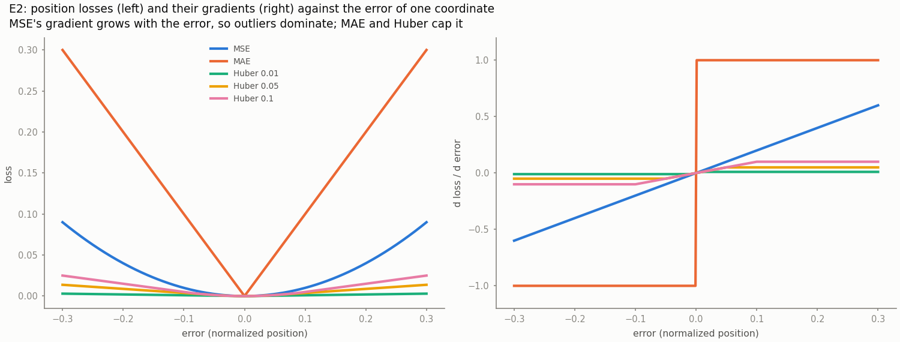

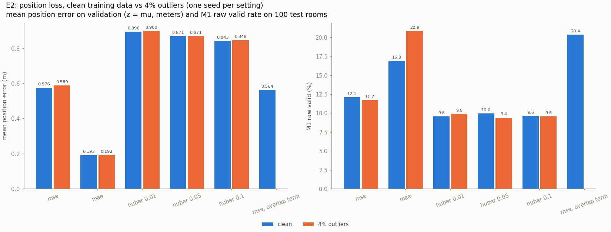

### 5.2 E3a: which hidden activation, with BatchNorm?

| Activation | Validation loss | M1 raw valid | M1 quality |
|---|---|---|---|
| ReLU (default) | 0.571 | 12.1% | 0.55 |
| Tanh | 0.574 | 22.2% | 0.64 |
| LeakyReLU | 0.582 | 9.8% | 0.53 |
| Sigmoid | 0.586 | 15.1% | 0.59 |
| GELU | 0.587 | 10.1% | 0.50 |
| ELU | 0.590 | 10.7% | 0.51 |

With BatchNorm, every activation trains: the validation losses lie within 0.02 of one another. ReLU and Tanh tie on the loss, but Tanh's samples are valid almost twice as often, so Tanh was shortlisted. Section 5.6 shows why it was *not* chosen.

### 5.3 E3b: what happens without BatchNorm?

This experiment is a diagnostic. It removes BatchNorm and makes the networks deeper to provoke the two classic failures. Every run trains for a fixed 60 epochs, and the losses below are validation losses at the end.

| Activation | Loss, 2 hidden layers | Loss, 6 hidden layers | Dead units at 6 layers |
|---|---|---|---|
| GELU | 0.61 | 0.62 | 0% |
| ELU | 0.62 | 0.64 | 0% |
| LeakyReLU | 0.62 | 0.81 | 0% |
| ReLU | 0.62 | 1.24 | **29%** |
| Tanh | 0.63 | 2.47 | 0% |
| Sigmoid | 0.62 | **4.87** | 0% |
| ReLU with BatchNorm | | 0.64 | 0% |
| Sigmoid with BatchNorm | | 1.05 | 0% |

- **Vanishing gradients.** With six Sigmoid layers the gradient norm at the encoder's first layer is about $10^{-10}$ (figure below). The network cannot learn: the KL term falls to 0, no latent unit stays active, the posterior has collapsed. The derivative of the Sigmoid is at most 0.25, and it is multiplied once per layer.
- **Dying ReLU.** At depth 6, 29% of the ReLU units output zero for every validation sample and receive no gradient. The loss doubles.
- **Smooth activations with a non-zero slope for negative inputs survive.** ELU and GELU lose almost nothing at depth 6.
- **BatchNorm hides both effects.** With it, deep ReLU has no dead unit and trains almost as well as at depth 2 (0.64), and deep Sigmoid trains (1.05 instead of 4.87). That is why the deployed model keeps BatchNorm, and why this diagnostic had to switch it off.

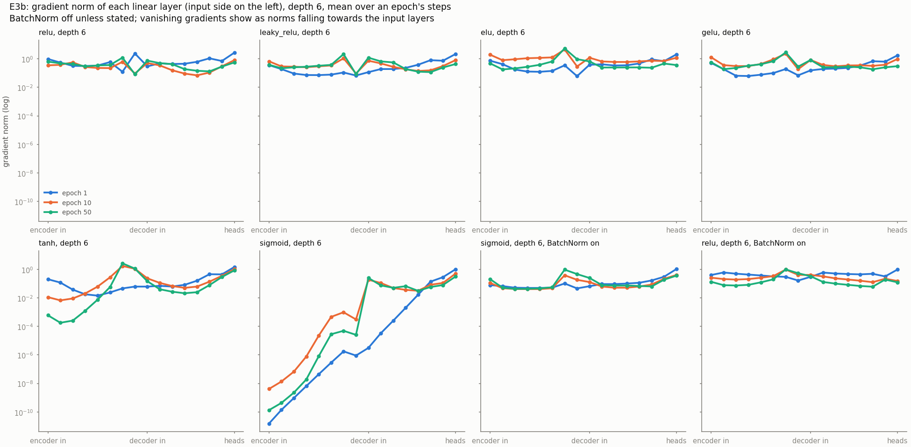

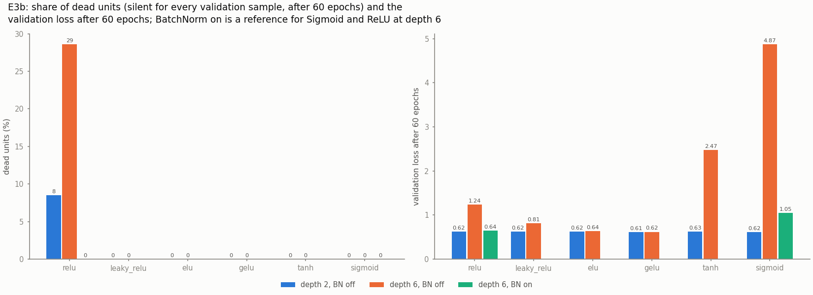

### 5.4 E4: which optimizer?

| Optimizer, learning rate | Epochs to reach a validation loss of 0.65 | Final validation loss |
|---|---|---|
| Adam, $10^{-2}$ | 22 | 0.577 |
| **Adam, $10^{-3}$ (default)** | 24 | **0.571** |
| SGD with momentum 0.9, 0.1 | 28 | 0.577 |
| RMSProp, $10^{-3}$ | 31 | 0.578 |
| SGD, 0.1 | 44 | 0.590 |
| SGD with momentum 0.9, 0.01 | 44 | 0.600 |
| Adam, $10^{-4}$ | 59 | 0.581 |
| RMSProp, $10^{-4}$ | 63 | 0.585 |
| SGD, 0.01 | 153 | 0.635 |

The first 20 epochs anneal $\beta$, so no run can reach the target much earlier. Adam at $10^{-3}$ gives the best final loss. The adaptive methods are tolerant of the learning rate (a hundredfold change of the learning rate costs Adam 37 epochs); plain SGD is not (a factor of 10 costs it 109 epochs and it is still improving after 200). Momentum makes SGD competitive, but only at the right learning rate.

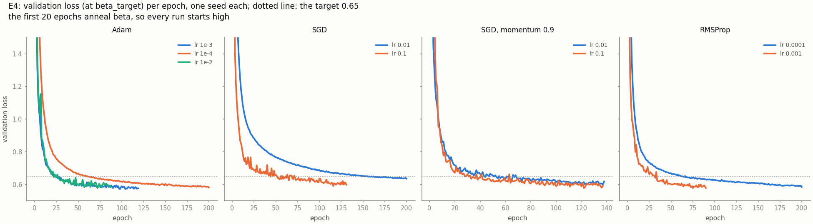

### 5.5 E5 to E7: KL weight, latent size, regularization, position head

**E5: KL weight and latent size.**

| Setting | Mean position error | Active units | M1 raw valid | M1 diversity |
|---|---|---|---|---|
| $\beta = 0.01$ | 0.18 m | 10 | 13.1% | 2.05 m |
| $\beta = 0.1$ (default) | 0.58 m | 8 | 12.1% | 1.87 m |
| $\beta = 0.5$ | 0.79 m | 7 | 9.9% | 1.60 m |
| $\beta = 1$ | 0.84 m | 5 | 12.0% | 1.49 m |
| latent size 4 | 0.61 m | 4 | 9.0% | 1.79 m |
| latent size 32 | 0.61 m | 8 | 11.7% | 1.84 m |

A larger $\beta$ pushes the encoder towards the prior: fewer active units, worse reconstruction, less diverse samples. No setting collapses completely. A latent size of 32 activates no more units than 16 (8 in both), so 16 is enough; 4 uses all of its units and is slightly worse. A smaller $\beta$ improves reconstruction as much as MAE does, but not the samples' validity, so $\beta$ stays at 0.1.

**E6: regularization.** Scored the same way on both splits (inference mode, same noise), the selected model's loss is 0.569 on the training split and 0.571 on validation: a gap of 0.002, and at most 0.007 in any variant. **The CVAE does not overfit.** It has 21,000 training layouts for 178,000 parameters, a low-dimensional target, and the KL term as a regularizer of its own. Dropout 0.3 only hurts (position error 0.70 m against 0.58 m). Training for a fixed 200 epochs instead of stopping early gains 0.012 in loss for three times the time, so early stopping stays.

One measurement trap is worth recording: the training loss *logged during training* was higher than the validation loss, which looks like "negative overfitting". It is not a real effect: during training dropout is active and BatchNorm uses batch statistics. The gap must be measured with both splits in inference mode.

**E7: does the Sigmoid head saturate near walls?** Items against a wall have targets near 0 or 1, where the Sigmoid's gradient vanishes, so we expected larger errors there. The opposite holds: 0.55 m for items within 5% of a wall, 0.58 m for the rest. Wall items are the easiest to predict (the generator always puts the same items against walls), and that outweighs any saturation. A linear head clamped to $[0, 1]$ is no better (0.57 and 0.62 m), so the Sigmoid head stays.

### 5.6 Choosing the frozen configuration

Screening shortlisted the three changes that raised M1's raw valid rate most: Tanh, the overlap term and MAE. Each was trained with **three seeds** and judged on **M2**, the method that is actually deployed, on **200 validation rooms** with 64 samples each. The rule was fixed before the runs: a candidate replaces the default if it beats it by more than the seed-to-seed spread on M2's raw valid rate or on its top-3 quality, without falling short by more than the spread on the other; if two qualify, they are also tried together.

| Candidate | Position error | M1 raw valid | M2 raw valid | M2 top-3 quality | M2 diversity |
|---|---|---|---|---|---|
| default (ReLU, MSE) | 0.58 m | 11.4 ± 0.8% | 67.1 ± 0.9% | 0.786 ± 0.009 | 2.00 m |
| Tanh | 0.62 m | 20.0 ± 1.3% | 64.0 ± 2.7% | 0.724 ± 0.009 | 2.00 m |
| overlap term | 0.59 m | 19.1 ± 0.8% | 71.8 ± 0.9% | 0.780 ± 0.012 | 2.07 m |
| **MAE** | **0.18 m** | 19.1 ± 2.1% | **72.1 ± 0.7%** | **0.850 ± 0.009** | **2.27 m** |
| MAE + overlap term | 0.18 m | 24.0 ± 1.0% | 73.0 ± 0.3% | 0.844 ± 0.010 | 2.27 m |

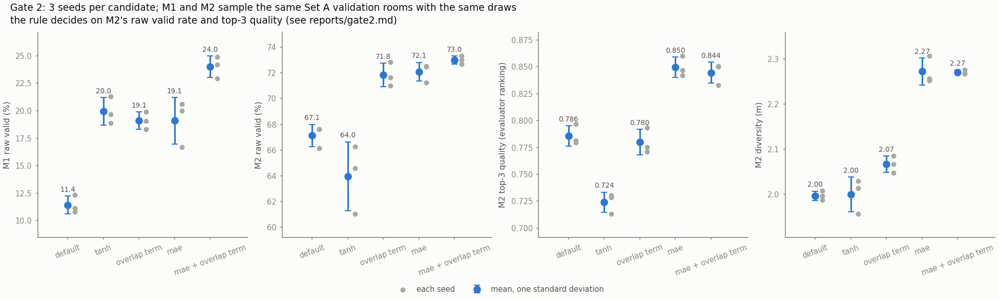

- **MAE is frozen.** It is the only single change that improves both metrics: 5 points more valid samples and a top-3 quality of 0.85 instead of 0.79. Combining it with the overlap term is no better beyond the spread, so the simpler model is kept.
- **M1 is a poor guide to M2.** Tanh almost doubles M1's validity in every seed, yet makes M2 *worse* on both metrics. Had we chosen on the screening numbers, we would have picked the wrong activation. We have not tested why. One possible explanation is that saturating Tanh units pass smaller gradients from the positions back to $z$, which is what latent optimization relies on.
- **This is why the choice was made on validation rooms, with the deployed method.**

The frozen configuration is the default with `position_loss: mae` (`configs/frozen.yaml`).

### 5.7 E8: how much does latent optimization help?

Frozen configuration, three seeds, 200 test rooms, 64 samples each.

| Optimization steps | Raw valid | Overlap per sample | Reachability | Diversity ratio to G0 | Seconds per room | Cost per valid layout |
|---|---|---|---|---|---|---|
| 0 (this is M1) | 17.0 ± 2.2% | 0.137 m² | 0.66 | 0.91 | 0.13 | 11.6 ms |
| 25 | 62.9 ± 1.7% | 0.012 m² | 0.82 | 0.95 | 0.26 | 6.5 ms |
| 50 | 67.2 ± 1.1% | 0.007 m² | 0.83 | 0.95 | 0.39 | 9.1 ms |
| 100 | 68.5 ± 0.8% | 0.005 m² | 0.83 | 0.95 | 0.66 | 15.0 ms |
| 200 | 69.0 ± 0.8% | 0.004 m² | 0.83 | 0.95 | 1.19 | 27.1 ms |

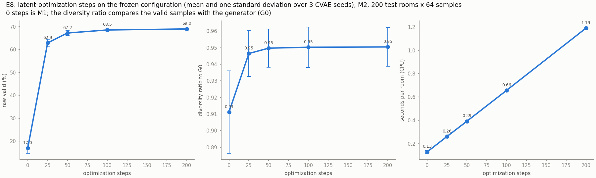

- **Latent optimization is what makes the pipeline work.** It quadruples the raw valid rate, from 17% to 69%.
- **Most of the gain comes early:** 25 steps reach 63%, 50 steps 67%. Beyond 100 steps almost nothing changes, and the time grows in proportion. The deployed 150 steps sit on the plateau (0.92 s per room): 50 steps would give 97% of the validity in about 40% of the time.
- **Per valid layout, 25 steps are cheapest** (6.5 ms). With fewer steps most samples are wasted; with more, time is spent on candidates that are already valid or cannot be repaired.
- **Diversity does not suffer.** The anchor to each candidate's start keeps them apart: the diversity ratio *rises* from 0.91 to 0.95, because more rooms have several valid layouts to compare.
- **What it cannot fix is reachability.** The share of reachable items stops at 0.83: the optimization target has no reachability term, because reachability is not differentiable. Section 7 shows that this is M2's main remaining failure.
- **It does not improve quality** (0.66 throughout). It repairs violations; it does not rearrange.

### 5.8 E9a: what can the CNN evaluator see?

Trained for 30 epochs on Set B (19 s per epoch on the GPU), best validation epoch 26. On the 9,000 test layouts:

| Accuracy | Precision (valid) | Recall (valid) | F1 (valid) | F1 (invalid) | ROC-AUC | Spearman with the rule score |
|---|---|---|---|---|---|---|
| 96.6% | 0.967 | 0.980 | 0.973 | 0.955 | 0.991 | 0.655 |

| Kind of layout | Accuracy |
|---|---|
| forced overlap | 100% |
| clean generator layouts | 99.8% (0.2% false alarms) |
| turned items | 95.0% |
| random placement | 94.1% |
| jitter 0.6 m / 0.3 m / 0.1 m | 92.8% / 91.0% / 91.8% |
| near-miss at the door zone | 91.1% |
| **near-miss overlap** | **81.4%** |

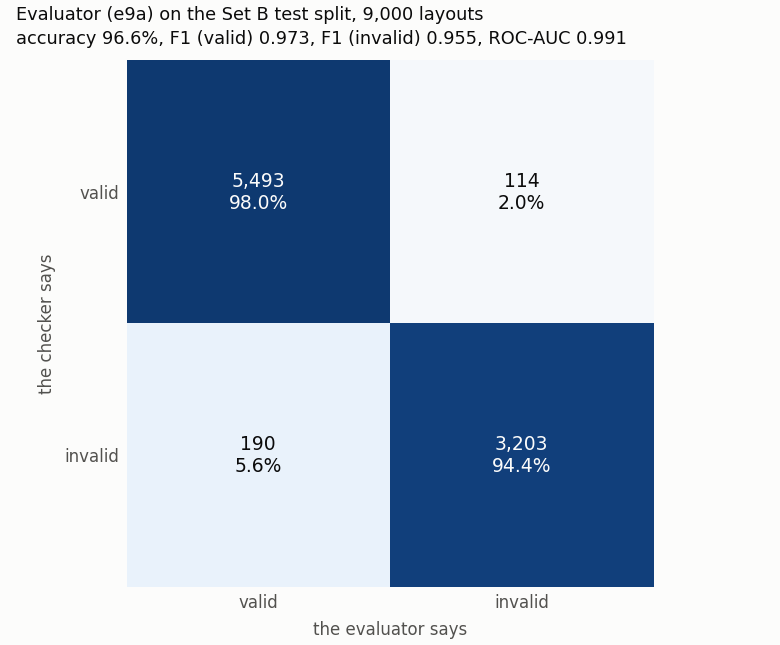

- **The CNN judges gross violations almost perfectly and boundary cases poorly.** A near-miss overlap of 0.005 m² along a 0.9 m edge is a strip about a tenth of a pixel wide. The fractional-coverage image does encode it, as a small change of pixel values, but the network resolves it only 81% of the time, against 50% for guessing.
- **This is why the checker, not the CNN, decides validity.** An overall accuracy of 96.6% would hide exactly the cases where a decision is hard; reporting per kind of layout exposes them.
- **Its score ranks layouts moderately well** (Spearman 0.655). Section 5.9 measures what that is worth in the pipeline.

### 5.9 E1: does the learned pipeline beat the baselines, and at what cost?

Frozen configuration; M1 and M2 as the mean ± standard deviation over three seeds; the same 500 test rooms and 64 raw samples per room for every method.

| Method | Raw valid | Overlap per sample | Reachability | Quality (valid) | Top 3 shown | Diversity ratio | Cost per valid layout |
|---|---|---|---|---|---|---|---|
| B1 uniform | 10.1% | 0.21 m² | 0.55 | 0.29 | 0.30 | 0.98 | 18.4 ms |
| B2 statistical | 57.8% | 0.002 m² | 0.70 | 0.55 | 0.62 | 1.02 | 4.0 ms |
| G0 generator (reference) | 74.7% per attempt | n/a | n/a | 0.88 | 0.89 | 1.00 | 2.4 ms |
| M1 CVAE | 17.3 ± 1.9% | 0.14 m² | 0.67 | 0.66 ± 0.04 | 0.78 ± 0.04 | 0.91 ± 0.02 | 10.5 ± 1.5 ms |
| **M2 CVAE + latent optimization** | **69.8 ± 0.9%** | 0.004 m² | 0.83 | 0.66 ± 0.03 | **0.85 ± 0.01** | 0.95 ± 0.01 | 21.1 ± 0.8 ms |

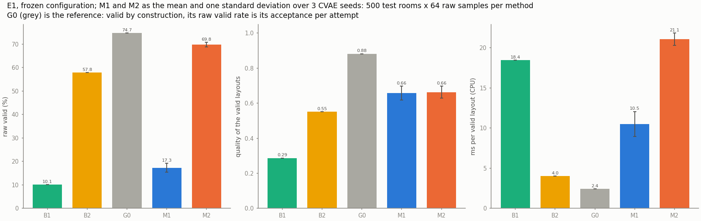

**Validity (goal G2).** M2 beats both non-neural samplers: 69.8% of its raw samples are valid, against 57.8% for B2 and 10.1% for B1. Every one of the 500 rooms gets at least three valid layouts from M2, 45 of 64 on average. **The CVAE alone does not meet the target we set in the PRD**, which expected the CVAE to beat B1 and B2: M1 beats B1 but reaches only 17.3%, far below B2. The learned pipeline's validity comes from latent optimization.

**Quality.** M2's valid layouts score 0.66, above B2's 0.55 and well below the generator's 0.88. What the user sees is better than that average, because the evaluator ranks the valid layouts:

| Quality of the top 3 when the valid layouts are ranked | B1 | B2 | G0 | M1 | M2 |
|---|---|---|---|---|---|
| not at all (random order) | 0.29 | 0.56 | 0.88 | 0.67 | 0.67 |
| by the CNN evaluator (the pipeline) | 0.30 | 0.62 | 0.89 | 0.78 | **0.85** |
| by the exact rule score (the reference) | 0.33 | 0.78 | 0.89 | 0.80 | 0.88 |

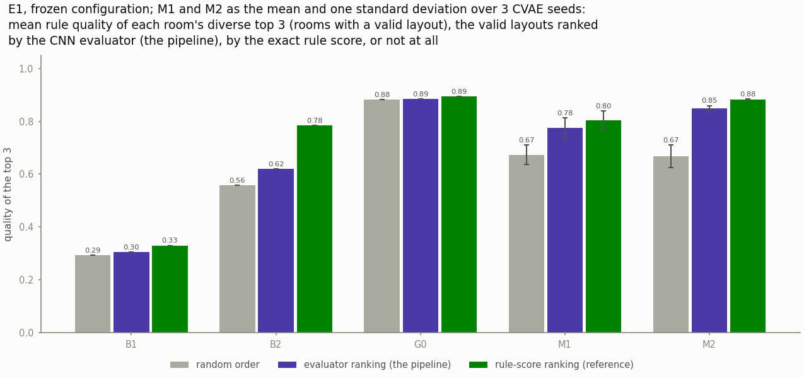

- **The evaluator earns its place as a ranker.** It lifts M2's top 3 from 0.67 to 0.85, which is 85% of the gain that ranking by the exact rule score would give, and brings the shown layouts close to the generator's 0.89.
- **It ranks the CVAE's layouts much better than B2's** (it realizes only 27% of the possible gain for B2). A likely reason, which we did not test: B2 copies each item's position from a different training layout, which produces arrangements unlike those in the evaluator's training data.
- The rule score would still rank slightly better and is free, so a product would use it. The CNN stays as the study it is, and as the part that could learn from human ratings.

**Diversity.** M2's valid layouts for a room are 95% as far apart as the generator's; the independent samplers B1 and B2 are trivially diverse. The CVAE covers slightly less variety than the generator it learned from.

**Cost.** Timed with the methods taking turns on 100 rooms, a valid layout costs M2 21.1 ms and the generator 2.4 ms. **For a request without pinned furniture the rule-based generator is about nine times cheaper, and its layouts score higher.** We expected this before measuring: M2 makes the same checker calls plus 150 decoder passes. B2 is also cheaper than M2 (4.0 ms), with clearly worse layouts.

*The absolute times are not stable.* The laptop's speed changes with its power and thermal state: an hour after this measurement, with the battery full, the same three baselines ran twice as fast (G0 0.056 s per room instead of 0.113 s). That is why all methods of a table are timed in one pass, taking turns room by room, and why only the ratios between methods should be quoted.

### 5.10 E10: rooms beyond the training distribution

Frozen configuration, three seeds; 500 rooms per set, 64 samples each. The three held-out sets were never seen in training or model selection (Section 3.4). G0 runs on the same rooms as the reference for how hard each set is by itself.

| Rooms | Mean area | M1 raw valid | M2 raw valid | G0 acceptance | M2 as a share of G0 | M2 quality (top 3) | G0 quality (top 3) |
|---|---|---|---|---|---|---|---|
| In distribution | 21 m² | 17.3 ± 1.9% | 69.8 ± 0.9% | 74.7% | 93% | 0.66 (0.85) | 0.88 (0.89) |
| Interpolation, 22 to 26 m² | 24 m² | 18.2 ± 2.2% | 74.3 ± 0.9% | 81.9% | 91% | 0.67 (0.85) | 0.89 (0.89) |
| Unseen combination, above 32 m² | 35 m² | 19.1 ± 1.5% | 84.4 ± 0.3% | 94.0% | 90% | 0.65 (0.83) | 0.87 (0.87) |
| Out of range, 7 to 8 m by 6 to 7 m | 49 m² | 18.0 ± 1.2% | 87.3 ± 0.5% | 95.8% | 91% | 0.60 (0.77) | 0.86 (0.86) |

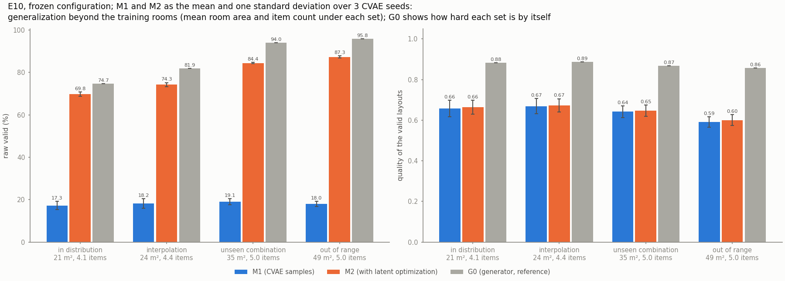

- **Validity does not suffer outside the training distribution.** M2's raw valid rate *rises* with room size, from 70% to 87%, because larger rooms have more free floor: the generator's own acceptance rises from 75% to 96%. Measured against that reference, M2 keeps 90 to 93% of G0's rate on every set.
- **The raw gap would mislead.** The PRD asked for "held-out minus in-distribution" validity. That number is positive here (+4.5, +14.6 and +17.5 points), which says the held-out rooms are easier, not that the model generalizes better than it fits. Comparing with G0 on the same rooms is the honest measure.
- **Quality is where generalization costs something.** In rooms larger than any training room, M2's top 3 fall from 0.85 to 0.77, while the generator's fall only from 0.89 to 0.86. In the gap inside the training range (interpolation) nothing is lost.
- **Latent optimization carries the validity.** M1 stays at 17 to 19% everywhere; the repair step does the rest in every set.
- **Two caveats.** Above 32 m² the generator almost only produces floating-sofa layouts, so the last two sets mostly test one style. And room size alone moves our quality score (larger rooms score higher on circulation), which is one more reason to read every set against G0.

### 5.11 E12: arranging a room around an item the user has pinned

The user fixes one item at a position, with a facing, and the method arranges the rest. This is the case we expected to justify the learned pipeline (Section 1.3): a template generator has no template for an arbitrary pin.

**Setup.** 360 requests: for each of the six items, 60 test rooms that contain it. The pin is the position and facing that item has in a generator layout of the same room, so a valid completion is known to exist. Every method gets 64 samples per request, and for each request the methods sample in turn, so their timings compare.

| Method | How it handles the pin |
|---|---|
| M2 | a pin term pulls the item to its spot during latent optimization, with its facing fixed; then the item is placed exactly on the spot |
| M1 | the CVAE's sample, with the item placed on the spot |
| G0-pin | a generator layout, with the item moved onto the spot |
| B1, B2 | the pinned item is placed first; B2 draws the others again while they overlap it |

In every method the pinned item ends exactly on its spot; the rule checker then decides.

**Raw valid rate with the item on its pin**

| Pinned item | B1 | B2 | G0-pin | M1 | M2 |
|---|---|---|---|---|---|
| sofa | 18.6% | 68.5% | 39.0% | 20.8 ± 1.5% | 42.6 ± 2.1% |
| TV unit | 20.6% | 67.7% | 50.4% | 23.4 ± 2.2% | 35.5 ± 3.6% |
| coffee table | 6.2% | 58.3% | 47.4% | 10.3 ± 1.0% | 45.7 ± 3.5% |
| bookshelf | 14.4% | 62.3% | 56.4% | 20.3 ± 1.7% | 53.8 ± 1.3% |
| armchair | 7.2% | 56.0% | 41.9% | 12.9 ± 1.3% | 33.2 ± 1.7% |
| side table | 10.1% | 61.1% | 49.7% | 18.2 ± 1.0% | 25.2 ± 1.2% |
| **all** | 12.8% | 62.3% | 47.5% | 17.6 ± 1.4% | 39.3 ± 2.2% |

**All 360 requests**

| Method | Raw valid | Requests with a valid layout | Quality (valid) | Distance from the pin before it is placed | Cost per valid layout |
|---|---|---|---|---|---|
| B1 | 12.8% | 86.1% | 0.39 | n/a | 14.8 ms |
| B2 | 62.3% | 100% | 0.57 | n/a | 3.7 ms |
| G0-pin | 47.5% | 99.2% | **0.80** | 2.08 m | 6.3 ms |
| M1 | 17.6 ± 1.4% | 95.0% | 0.62 | 2.12 m | 10.5 ms |
| M2 | 39.3 ± 2.2% | 99.4% | 0.67 | **0.14 m** | 36.1 ms |

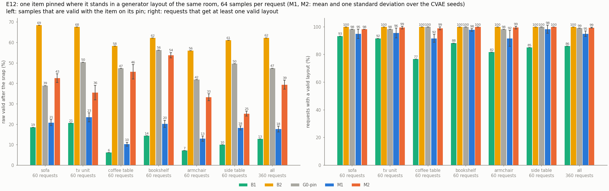

- **The pin mechanism works.** Latent optimization brings the pinned item to within 0.14 m of its spot before it is placed there; M1's samples and the generator's layouts have it about 2.1 m away. M2 finds at least one valid layout for 99.4% of the requests, 25 of 64 samples on average.
- **The expectation that pinning would justify the learned pipeline is not supported.** The generator with the item simply moved is valid more often than M2 (47.5% against 39.3%), its layouts score higher (0.80 against 0.67), and a valid layout costs it about a sixth as much (6.3 ms against 36 ms). Only for the sofa is M2 ahead on validity (42.6 ± 2.1% against 39.0%), and there its quality is lower too (0.57 against 0.68).
- **B2 gives the most valid samples** (62.3%) at the lowest cost, because it places the pinned item first and redraws the others against it. Its layouts are the least well arranged of the three (0.57).
- **Why M2 loses, as far as we can tell.** Its validity falls from 70% without a pin to 39% with one. The decoder was never trained with pins: it knows the room and the furniture, and $z$ selects among the arrangements it learned. Pulling one item two meters through $z$ either switches to another arrangement or stretches the current one into something the decoder never produced, and placing the item over the last 0.14 m can recreate an overlap the optimization had just removed. We did not test these explanations separately.
- **A caveat on the setup.** The pins are positions the generator itself produces. That guarantees a valid completion exists, and it also suits G0-pin, whose other items come from the same family of arrangements. Pins far from any generator layout were not tested. We would expect every method to do worse there and have no evidence that the order would change.

A decoder that receives the pin as part of its condition, trained on layouts with one item marked as fixed, would be the direct way to attack this. It is future work.

### 5.12 The targets we set, and whether they were met

The PRD fixed these before any model was trained.

| Target | Result | Met? |
|---|---|---|
| Raw valid rate: the CVAE beats B1 and B2; with latent optimization at least as good | M1 17.3%, B1 10.1%, B2 57.8%, M2 69.8% | **Partly.** M2 beats both. M1 alone beats only B1 |
| Mean overlap lower than every baseline | M2 0.004 m², B2 0.002 m², B1 0.21 m² | **No.** B2 redraws on overlap and ends lower |
| Mean quality of valid layouts higher than the baselines | M2 0.66, B2 0.55, B1 0.29 | Yes |
| Evaluator F1 about 0.90 or better | 0.973 | Yes |
| Latency at most 5 s per request | 1 to 2 s end to end (0.92 s for sampling, repairing and checking 64 candidates) | Yes |
| CVAE training at most 15 min, evaluator at most 30 min | about 1 to 3 min; about 10 min on the GPU | Yes |
| Reachability, diversity, cost, ranking agreement and the generalization gap reported | Sections 5.7 to 5.10 | Reported |
| Pinned completion as the case for the learned pipeline | G0-pin is better on validity, quality and cost | **No** |

---

## 6. Demo

`python run.py app` opens a Streamlit app with a sidebar and three tabs.

- **Sidebar.** The room's width and depth, the door's wall and position, the furniture with its variants, a budget, an optional pinned item with its position and facing, the number of candidates, latent optimization on or off, and a seed.
- **Layouts.** The top 3, each with its quality score, cost, share of the floor covered, the result of each hard check, the four quality terms, and JSON and PNG downloads.
- **Compare methods.** B1, B2, G0, M1 and M2 sample the same room; a table counts their valid samples and each method's best layout is drawn.
- **Training and results.** The saved figures of every experiment.

The pictures below are produced by the app's own code (`python run.py demo-assets`) for a 5 × 4 m room with a sofa, a TV unit, a coffee table and an armchair.

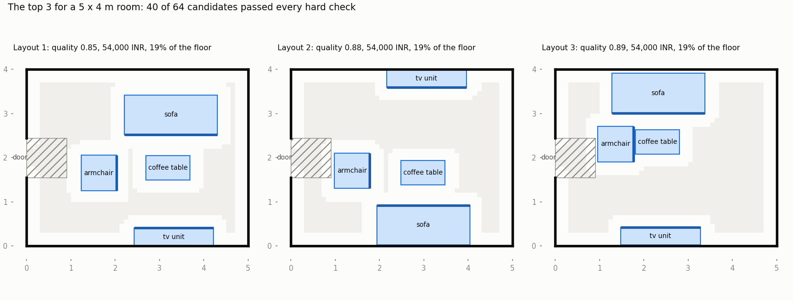

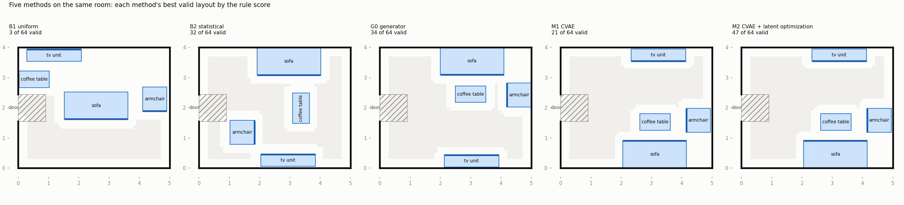

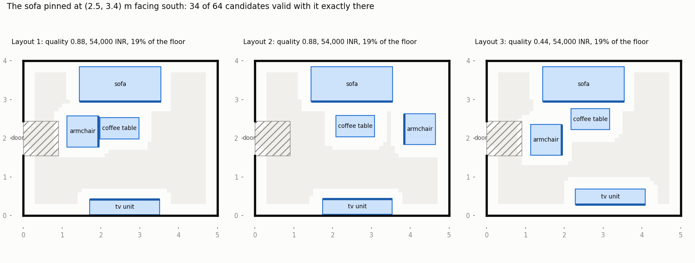

What the app does with a request it cannot serve matters as much as the layouts:

- **Too much furniture for the room, or too small a budget:** it says so and suggests what to change, and shows no layout.
- **A room outside the training ranges:** it warns and still tries.
- **A pin that cannot be honoured** (the item would stick out of the room or stand in the door's clearance zone): it says which item and why.
- **No trained models on the machine:** it opens and names the command that creates each. (The final models are committed in `checkpoints/`, so a fresh clone runs the app at once.)

A headless test runs the whole app, including these cases (`tests/test_app.py`).

---

## 7. Failure cases

B1, B2, M1 and M2 each sampled the same 100 test rooms 64 times, and every sample was classified by the hard checks it breaks ([failure_cases.md](failure_cases.md) has the full analysis and describes each case of the gallery).

| Share of all samples | B1 | B2 | M1 | M2 |
|---|---|---|---|---|
| Valid | 9.9% | 58.6% | 14.4% | 67.8% |
| Breaks H1, out of room | 0.0% | 0.3% | 29.7% | 4.0% |
| Breaks H2, overlap | 70.9% | 1.2% | 56.7% | 6.4% |
| Breaks H3, door blocked | 40.9% | 31.9% | 34.3% | 9.6% |
| Breaks H4, unreachable | 63.3% | 34.9% | 45.0% | 28.4% |
| Breaks only H4 | 7.1% | 8.5% | 1.9% | 18.5% |
| Valid but poor (score below 0.5) | 9.7% | 20.8% | 3.1% | 17.6% |

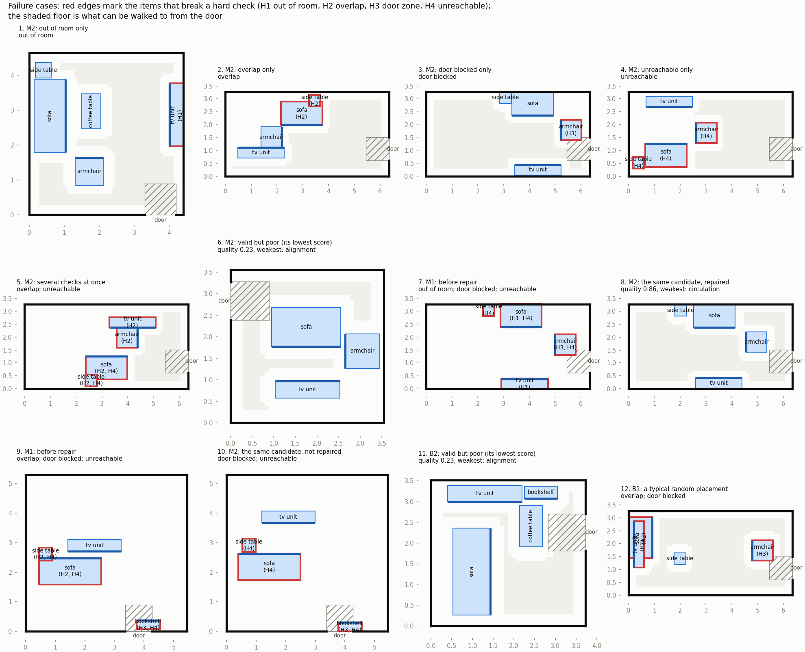

- **Latent optimization repairs what it targets.** From M1 to M2, on the same candidates, it removes 87% of the out-of-room failures, 89% of the overlaps and 72% of the door blockages (cases 7 and 8 show one repair).
- **Reachability is M2's main remaining failure.** The optimization has no term for it, and only 37% of those failures disappear as a side effect. 18.5% of all M2 samples fail on reachability *alone*: nothing overlaps, the door is free, but some item cannot be walked to (case 4). That is more than half of M2's failures.
- **The raw CVAE fails on small errors.** Its items are about 0.2 m off, enough to overlap a neighbour or stick through a wall. The Sigmoid keeps an item's centre in the room, not its footprint.
- **Valid is not the same as good.** A quarter of M2's valid samples score below 0.5, typically with an item that belongs against a wall standing in the open (case 6). Ranking exists to keep those out of the top 3.
- **No collapse:** every room got valid layouts from M2, and its least varied room still has layouts 1.05 m apart on average.

---

## 8. Limitations, ethics and deployment

**Limitations**

- **Synthetic data.** The model learns our rule-based notion of a good layout, not a designer's taste. The design rules, the score weights and the catalog are our assumptions.
- **The rule-based generator is better than the learned pipeline, with or without a pinned item.** It is cheaper per valid layout and its layouts score higher (Sections 5.9 and 5.11). The learned pipeline's results must be read against that reference.
- **Reachability is not optimized.** It is not differentiable, so latent optimization cannot repair it, and it is M2's most frequent remaining failure (Section 7).
- **Simplified geometry.** Rectangular rooms, one door, six items, four facings, no windows or built-in furniture.
- **Rejection-sampling bias.** Crowded arrangements are rarer in the data than a designer would produce, because they are harder for the generator to place.
- **Image resolution.** Violations at the checker's tolerance are near the resolution limit of the evaluator's input; it resolves near-miss overlaps only 81% of the time.
- **Small-scale evidence.** Three seeds describe the spread; they are not a significance test. The first shortlist of settings used test rooms for M1's validity; the final choice used validation rooms only.
- **Timings.** They come from one laptop whose speed changes with its power and thermal state. They were measured with the methods taking turns on the same rooms; their ratios are meaningful, their absolute values less so.

**Ethics.** No personal data is used. The outputs are not architectural or safety advice: fire exits, accessibility rules and building codes are not modelled, and the "quality" score is an assumption of ours, not a measure of how people want to live.

**Deployment.** The demo is a local Streamlit app. For real use, the pipeline would sit behind a small API, with versioned models and datasets, validated inputs, and a warning for rooms outside the training ranges, which the app already gives. The rule checker would stay in front of every output.

---

## 9. Conclusion and future work

We built a complete, tested and reproducible pipeline that generates furniture layouts as structured data, and used it to study its deep learning parts one at a time.

- **Latent optimization is the part that makes the learned pipeline work.** It raises the share of valid samples from 17% to 70% without losing diversity, by carrying a geometric gradient back through the frozen decoder.
- **The loss scale matters more than the loss shape.** MAE beat MSE and Huber because of how its size balances against the KL term, not because of outliers.
- **Model selection must use the deployed method.** Tanh doubled the validity of the raw CVAE samples and lowered the validity after latent optimization.
- **BatchNorm hides vanishing gradients and dying ReLU;** removing it makes both visible and measurable.
- **A CNN reads gross violations from a layout image almost perfectly and boundary cases poorly,** which is why an exact checker decides validity and the CNN only ranks.
- **The honest baseline is the rule-based generator, and it wins.** For ordinary requests it is about nine times cheaper per valid layout and its layouts score higher. For requests with a pinned item, where we expected the learned pipeline to be ahead, the generator with the item moved is still better.
- **What the learned pipeline does beat is sampling without a template:** it gives more valid and better layouts than uniform or statistical placement.

**Future work.** A decoder that takes the pin as part of its condition, so that pinned completion is learned rather than forced through $z$. A differentiable stand-in for reachability, or the CNN as a surrogate inside latent optimization, to attack M2's main failure. Training on designer-made rooms, so the model learns more than our rules. A set-based generator (a transformer) for any number of items. Windows and non-rectangular rooms. A ranker tuned on human ratings.

---

## 10. Appendix

### 10.1 Mathematical derivations

[appendix_math.md](appendix_math.md) derives every loss, gradient and metric used here: the layer-wise backpropagation rule, the Sigmoid and softmax gradients, MSE, MAE and Huber, the optimizers, the ELBO, the KL term, the reparameterization, the penetration depth and the latent-optimization gradient, with the test or experiment that checks each.

### 10.2 Hyperparameters of the frozen configuration

| Part | Setting |
|---|---|
| CVAE | 2 hidden layers of 256 units in the encoder and in the decoder; BatchNorm; ReLU; dropout 0.1; latent size 16; Sigmoid position head; MAE position loss; rotation cross-entropy weight 1 |
| CVAE training | Adam, learning rate $10^{-3}$, batch 256; $\beta$ from 0 to 0.1 over 20 epochs; at most 200 epochs; early stopping with patience 15, counted after annealing |
| Evaluator | 4 blocks of 3×3 convolution, BatchNorm, ReLU, max-pooling with 16, 32, 64, 64 channels; 128 hidden units; dropout 0.3; BCE plus squared score error; Adam, $10^{-3}$, batch 256, 30 epochs, best validation epoch kept |
| Evaluator input | 4 channels, 128 × 128 pixels, 8 m canvas, front band 0.10 m |
| Latent optimization | Adam, learning rate 0.05, at most 150 steps; weights 10 (overlap), 10 (room), 10 (door), 20 (pin), 0.05 (anchor); margin 0.05 m; a candidate stops below $10^{-4}$ |
| Pipeline | 64 candidates; top 3 at least 0.3 m apart, relaxed by 25% up to twice; footprint limit $f_\text{max} = 0.38$ |
| Seeds | 0, 1, 2 for the CVAE; 0 for everything else |

Every value lives in `configs/default.yaml`, `configs/frozen.yaml` and `configs/rules.yaml`; nothing is hard-coded.

### 10.3 Reproducing the results

```
pip install torch==2.5.1 --index-url https://download.pytorch.org/whl/cu121
pip install -r requirements.txt
python run.py check-env          # versions, GPU, determinism
python run.py test               # 400 tests
python run.py app                # the demo

python run.py all --list         # every step, in order
python run.py all                # regenerate everything (about eight hours; keep the laptop plugged in)
python run.py check-regeneration # compare with the saved tables, models and dataset
```

Setting `SPACEGEN_OUTPUT` to an empty folder first makes `all` write there, so the regeneration starts from nothing and leaves the saved results untouched. Tables are compared outside their timing columns and must be exactly equal; models and the dataset are compared by hash.

**What was checked (9 October 2026).**

- **A fresh clone works.** A clone of the repository from GitHub, with no `data/` and no `runs/`, passes all 400 tests. The pipeline generates layouts straight from the committed checkpoints (62 of 64 candidates valid for the demo room, in 1.9 s), and `python run.py figures` redraws the figures byte for byte.
- **The dataset is reproduced.** Rebuilt in that clone in five minutes, it has the identical content hash.
- **The models are reproduced.** The three frozen CVAE seeds, retrained from `configs/frozen.yaml`, are bit-identical to those trained two days earlier for Section 5.6. The hashes of all 64 trained models are in `reports/model_hashes.json`.
- **The tables are reproduced where they were recomputed.** The baselines' rows of E1 equal the Week 1 baseline table. The screening tables, rebuilt from the saved runs with each run's sampling check repeated, equal the saved ones in every shared column.
- **A complete regeneration.** `python run.py all` into an empty folder, followed by `python run.py check-regeneration`, repeats the comparison for every step of the project. [regeneration.md](regeneration.md) logs what our run of it gave.

### 10.4 References

1. P. Merrell, E. Schkufza, Z. Li, M. Agrawala, V. Koltun. Interactive Furniture Layout Using Interior Design Guidelines. *ACM Transactions on Graphics (SIGGRAPH)*, 30(4), 2011.
2. L.-F. Yu, S.-K. Yeung, C.-K. Tang, D. Terzopoulos, T. F. Chan, S. J. Osher. Make it Home: Automatic Optimization of Furniture Arrangement. *ACM Transactions on Graphics (SIGGRAPH)*, 30(4), 2011.
3. K. Wang, M. Savva, A. X. Chang, D. Ritchie. Deep Convolutional Priors for Indoor Scene Synthesis. *ACM Transactions on Graphics (SIGGRAPH)*, 37(4), 2018.
4. D. Paschalidou, A. Kar, M. Shugrina, K. Kreis, A. Geiger, S. Fidler. ATISS: Autoregressive Transformers for Indoor Scene Synthesis. *NeurIPS*, 2021.
5. J. Tang, Y. Nie, L. Markhasin, A. Dai, J. Thies, M. Nießner. DiffuScene: Denoising Diffusion Models for Generative Indoor Scene Synthesis. *CVPR*, 2024.
6. H. Fu, B. Cai, L. Gao, L.-X. Zhang, J. Wang, C. Li, Q. Zeng, C. Sun, R. Jia, B. Zhao, H. Zhang. 3D-FRONT: 3D Furnished Rooms with layOuts and semaNTics. *ICCV*, 2021.
7. A. A. Jyothi, T. Durand, J. He, L. Sigal, G. Mori. LayoutVAE: Stochastic Scene Layout Generation from a Label Set. *ICCV*, 2019.
8. D. P. Kingma, M. Welling. Auto-Encoding Variational Bayes. *ICLR*, 2014.
9. K. Sohn, H. Lee, X. Yan. Learning Structured Output Representation using Deep Conditional Generative Models. *NeurIPS*, 2015.
10. I. Higgins, L. Matthey, A. Pal, C. Burgess, X. Glorot, M. Botvinick, S. Mohamed, A. Lerchner. beta-VAE: Learning Basic Visual Concepts with a Constrained Variational Framework. *ICLR*, 2017.
11. S. R. Bowman, L. Vilnis, O. Vinyals, A. M. Dai, R. Jozefowicz, S. Bengio. Generating Sentences from a Continuous Space. *CoNLL*, 2016.
12. K. Kikuchi, E. Simo-Serra, M. Otani, K. Yamaguchi. Constrained Graphic Layout Generation via Latent Optimization. *ACM Multimedia*, 2021.
13. D. P. Kingma, J. Ba. Adam: A Method for Stochastic Optimization. *ICLR*, 2015.
14. S. Ioffe, C. Szegedy. Batch Normalization: Accelerating Deep Network Training by Reducing Internal Covariate Shift. *ICML*, 2015.
15. N. Srivastava, G. Hinton, A. Krizhevsky, I. Sutskever, R. Salakhutdinov. Dropout: A Simple Way to Prevent Neural Networks from Overfitting. *Journal of Machine Learning Research*, 15, 2014.

The deep learning methods of Sections 4 and 5 use [8] to [11] and [13] to [15]. No code was copied from any of these works.
